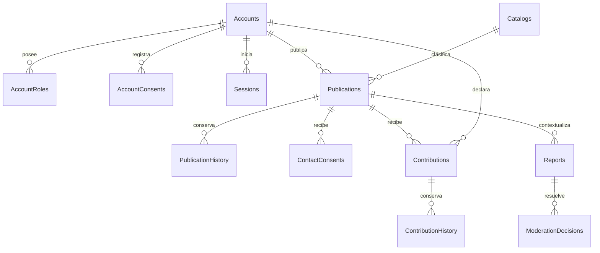

# Modelos y módulos del MVP local

## Separación de responsabilidades

`apps/back/src/composition.ts` construye un monolito modular. Un router valida datos con Zod y traduce HTTP; un servicio aplica reglas y permisos; un repositorio implementa persistencia. Los modelos y puertos de negocio no importan Express ni mssql. `Runtime` inyecta reloj e identificadores; autenticación recibe interfaces de derivación de contraseñas y tokens.

| Principio SOLID | Aplicación verificable |
| --- | --- |
| Responsabilidad única | Routers, servicios, modelos, adaptadores SQL y composición separados |
| Abierto/cerrado | Persistencia y criptografía se sustituyen implementando puertos, sin cambiar casos de uso |
| Sustitución | Las pruebas usan repositorios en memoria con los mismos contratos que SQL |
| Segregación de interfaces | Puertos específicos AccountRepository, PublicationRepository, ContributionRepository y ReportRepository |
| Inversión de dependencias | Servicios dependen de interfaces; composición conoce las implementaciones |

Solicitudes y ofertas son un modelo discriminado `need|offer`, con servicios de entrada especializados y reglas comunes de propiedad, estado y publicación. Los permisos se aplican en backend; la interfaz solo presenta acciones disponibles.

## Persistencia

| Migración | Entidades | Responsabilidad |
| --- | --- | --- |
| 001_application_info.sql | ApplicationInfo | Identificación/diagnóstico de la base |
| 002_catalogs_audit.sql | Catalogs, Audit | Catálogos configurables y registro de acciones |
| 003_accounts.sql | Accounts, AccountRoles, AccountConsents, Sessions | Identidad local, preferencias y sesiones revocables |
| 004_publications.sql | Publications, PublicationHistory | Solicitudes/ofertas, versión e historial |
| 005_contact.sql | ContactConsents | Confirmación del interesado antes del canal externo |
| 006_contributions.sql | Contributions, ContributionHistory | Aportes, idempotencia y cambios de estado |
| 007_reports.sql | Reports, ModerationDecisions; Contributions.Hidden | Moderación manual y visibilidad |

`SchemaMigrations` registra nombre, checksum y fecha. El ejecutor utiliza bloqueo de aplicación para excluir migraciones simultáneas; cada archivo pendiente se aplica en transacción. Son migraciones de avance: añadir 008 y posteriores, nunca editar las aplicadas ni reiniciar el volumen como solución de un conflicto.

Relaciones y estados tienen restricciones SQL; los índices atienden muro, cuentas, sesiones, aportes y reportes. Mutación de negocio, historial y auditoría se escriben en la misma transacción. La actualización de publicaciones/contribuciones/reportes exige versión vigente. La unicidad actor + Idempotency-Key se comprueba también en SQL, incluyendo carreras de creación.

## Privacidad y autenticación

Contraseñas con scrypt, sal aleatoria y comparación resistente a diferencias de tiempo; token opaco aleatorio de 32 bytes y hash SHA-256 persistido. Las sesiones vencen a las 12 horas y se revocan al desactivar o cambiar privilegios. El modo local exige `AUTH_MODE=local` y rechaza `NODE_ENV=production`.

Los DTO públicos enumeran sus campos explícitamente, incluyendo los eventos de cronología. El teléfono solo sale por contacto tras comprobar ambos consentimientos vigentes. Los cambios de perfil alteran únicamente roles públicos, evitando reintroducir privilegios revocados durante una edición concurrente.

`state` de publicación y restricción `hidden` son dimensiones distintas. Un reporte pendiente no es prueba ni verificación automática. Desactivar una cuenta bloquea su acceso y retira sus publicaciones públicas; no ejecuta eliminación definitiva.

## Angular

Componentes standalone agrupados en `features/{wall,account,publish,mine,detail,admin,safety}` con rutas lazy. `core` contiene modelos, cliente común y servicios específicos; `shared` contiene diálogo, mensajes y traducción de estados. Se usan formularios reactivos, signals y confirmaciones nativas mediante dialog.

La UI obtiene datos de APIs reales y no incorpora hogares ficticios como datos sembrados. El diseño sigue SRS/mockup; las diferencias de precedencia están en [trazabilidad](lectura-y-trazabilidad.md). Las evidencias de ejecución están en [verificación](verificacion-mvp-local.md).
